<a id="readme-top"></a>

# DFS Recipes

> Web application leveraging the generative capabilities of Large Language Models (LLMs) to analyze and transform player
> game log statistics into dynamic, user-driven data visualizations.
> Built using LangChain, FastAPI, Pydantic, AG Grid, Apache ECharts, and Webpack.

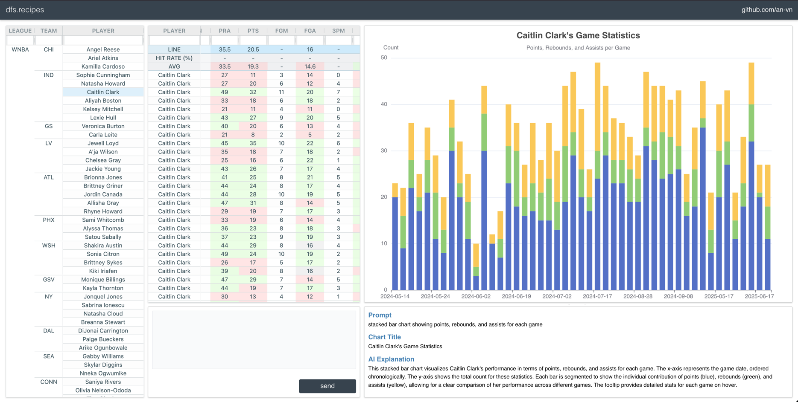

<details>
  <summary>Table of Contents</summary>
  <ul>
    <li>
      <a href="#about-the-project">About The Project</a>
      <ul>
        <li><a href="#background">Background</a></li>
        <li><a href="#overview">Overview</a></li>
        <li><a href="#design">How It Works</a></li>
      </ul>
    </li>
    <li>
      <a href="#llm-generated-samples">LLM Generated Samples</a>
      <ul>
        <li><a href="#stacked-line-chart">Stacked Line Chart</a></li>
        <li><a href="#multiple-pie-charts">Multiple Pie Charts</a></li>
        <li><a href="#scatter-plot---colored-points">Scatter Plot - Colored Points</a></li>
        <li><a href="#scatter-plot---emphasized-points">Scatter Plot - Emphasized Points</a></li>
        <li><a href="#stacked-radial-bar-chart">Stacked Radial Bar Chart</a></li>
        <li><a href="#box-plot">Box Plot</a></li>
        <li><a href="#calendar-heatmap">Calendar Heatmap</a></li>
      </ul>
    </li>
    <li><a href="#roadmap">Roadmap</a></li>
  </ul>
</details>

# About The Project

## Background

> Daily Fantasy Sports (DFS) Recipes is a personal project derived from my interest in sports, data analysis, and
> artificial intelligence.

## Overview

> Analyze player game log datasets with the ability to search, filter, sort, and dynamically compare data with projected
> stat lines

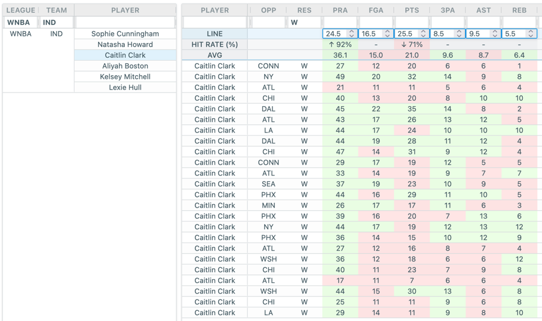

> Generate interactive charts from the rendered dataset by specifying data visualization requirements

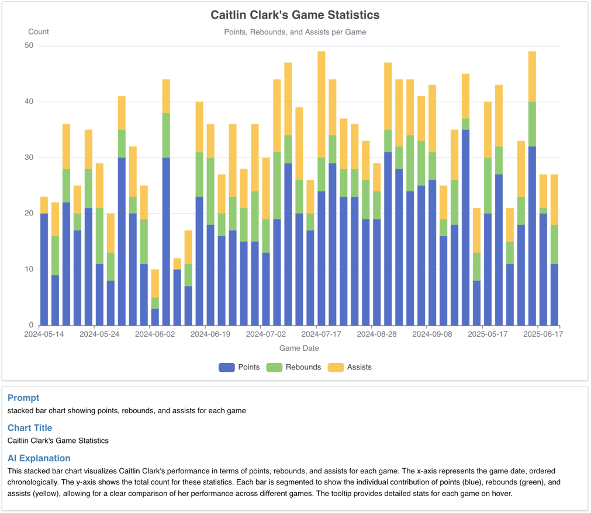

> Continuously iterate over datasets, dynamically generated charts based on the filtered dataset

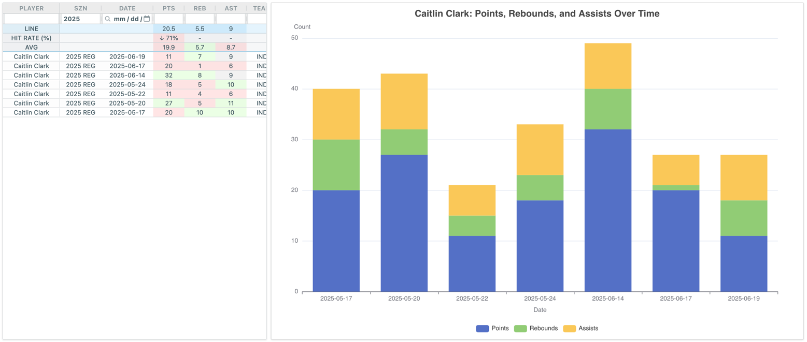

## How It Works

The user provides the data visualization requirement

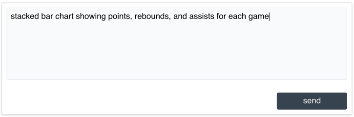

- The LLM is asked to generate a JavaScript function that returns a valid Apache ECharts configuration object based on
  the user's visualization requirements, a dataset description, and a sample of the dataset
- To reduce the risk of prompt injection
    - The user's input is validated using Pydantic, which is limited to 200 characters and must consist only of
      alphanumeric
      characters, spaces, and punctuation
    - The system prompt instruction segments are separated using characters that
      the user cannot input such as curly braces, square brackets, and asterisks

``` text
# System Prompt

You are an Apache Echarts expert.

Write a JavaScript function `createChartOptions` that generates an Apache ECharts configuration object based on the provided data and user's data visualization requirements.
Perform any necessary data transformations to prepare the data for visualization.

[BEGIN DATA]
************

OUTPUT FORMAT:
const createChartOptions = (data) => {
    // YOUR CODE GOES HERE - perform any necessary data transformations here

    return {
        // YOUR CODE GOES HERE - return an ECharts configuration object
    }
};

USER REQUIREMENTS:
{user_requirements}

DATASET DESCRIPTION:
{dataset_description}

DATASET SAMPLE:
{dataset_sample}

************
[END DATA]
```

- The generated JavaScript code is validated using a static code analysis tool to ensure it adheres to the expected
  format and does not contain any unsafe operations
- The code is then wrapped in a web worker to isolate execution and prevent direct access to the
  DOM or global scope
- The web worker invokes the `createChartOptions` function and communicates the result with the main thread, which
  renders the chart

```javascript
// Sandbox Worker Template

export function spawnSandboxWorker(appCode) {
    appCode = `${appCode}
onmessage = (e) => {
    try {
        const options = JSON.stringify(createChartOptions(e.data));
        postMessage({ options: JSON.parse(options) });
    } catch (e) {
        postMessage({ error: e.message });
    }
};
`
    const blob = new Blob([appCode]);
    return new Worker(window.URL.createObjectURL(blob));
}
```

<p align="right"><a href="#readme-top">(back to top)</a></p>

# LLM Generated Samples

## Stacked Line Chart

**Prompt:** stacked line chart showing points, rebounds, assists, blocks, and steals throughout the season
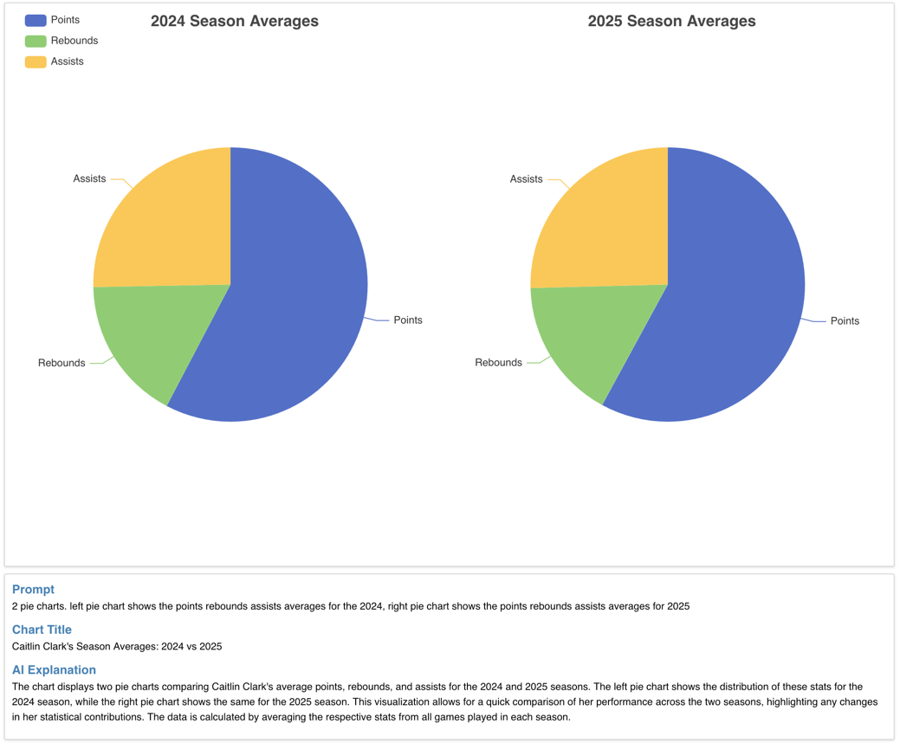
<p align="right">(<a href="#readme-top">back to top</a>)</p>

## Multiple Pie Charts

**Prompt:** 2 pie charts, left pie chart shows the points, rebounds, assists averages for 2024, right pie chart shows
the points, rebounds, assists averages for 2025
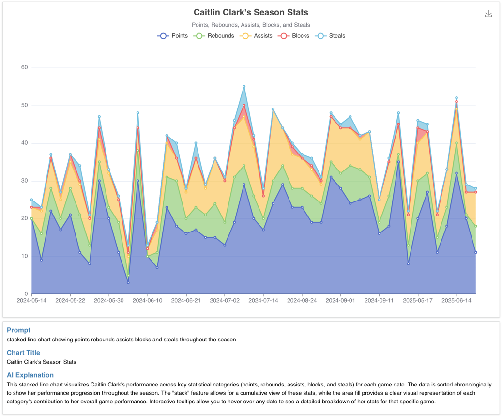
<p align="right">(<a href="#readme-top">back to top</a>)</p>

## Scatter Plot - Colored Points

**Prompt:** scatter plot showing points scored for each game over time, color each point based on the result of the game
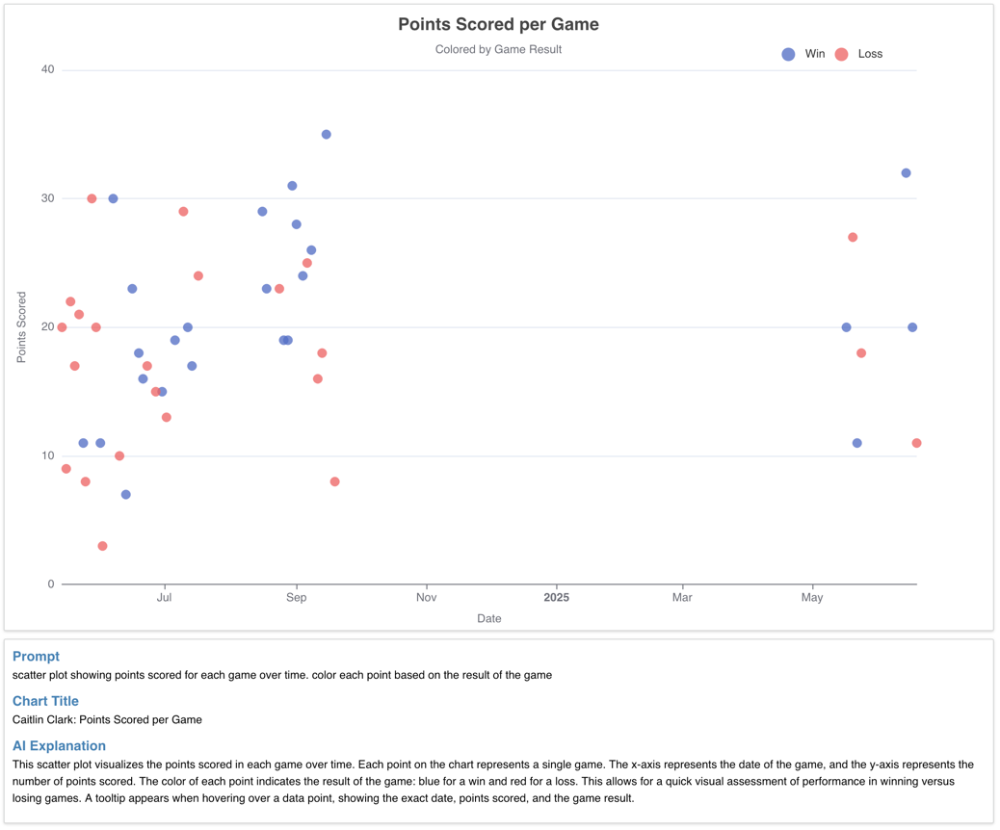
<p align="right">(<a href="#readme-top">back to top</a>)</p>

## Scatter Plot - Emphasized Points

**Prompt:** scatter chart showing minutes played for each game over time, emphasizing any games that went OT
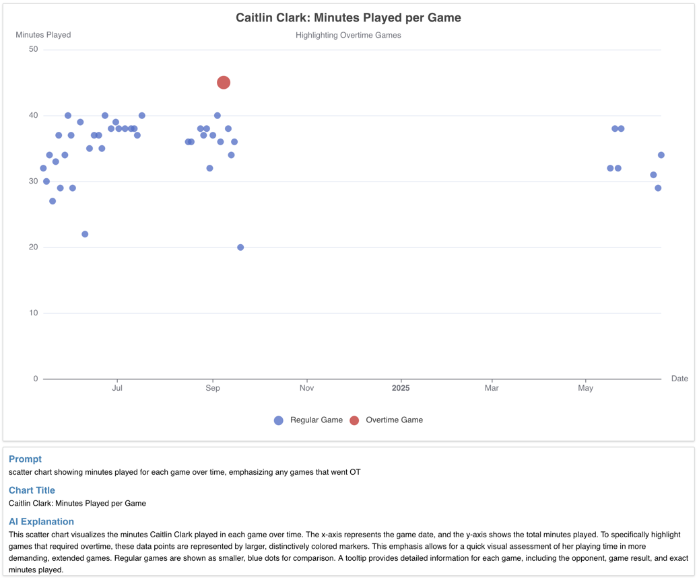
<p align="right">(<a href="#readme-top">back to top</a>)</p>

## Stacked Radial Bar Chart

**Prompt:** stacked radial bar chart showing field goal attempts and field goals made averages against each time
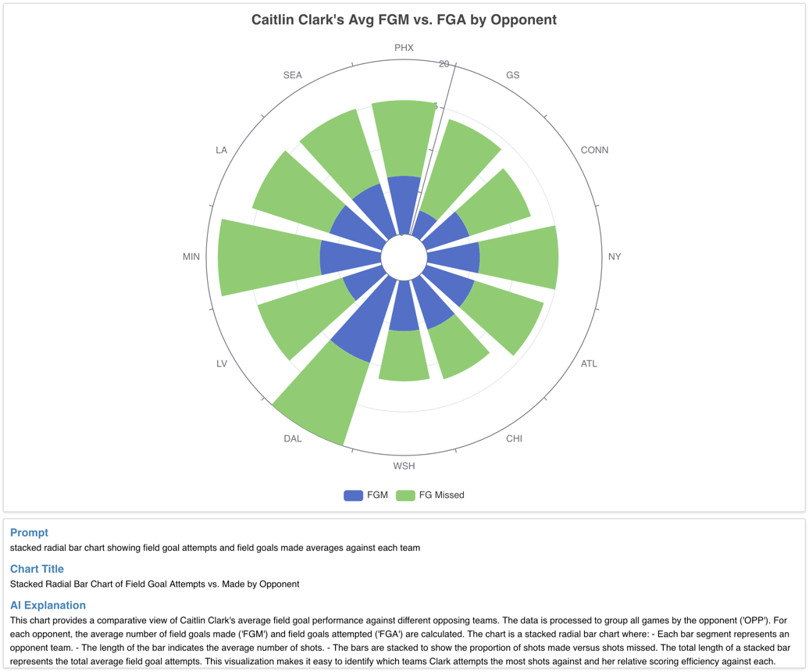
<p align="right">(<a href="#readme-top">back to top</a>)</p>

## Box Plot

**Prompt:** box plot chart aggregating the highs and lows of points scored against each team
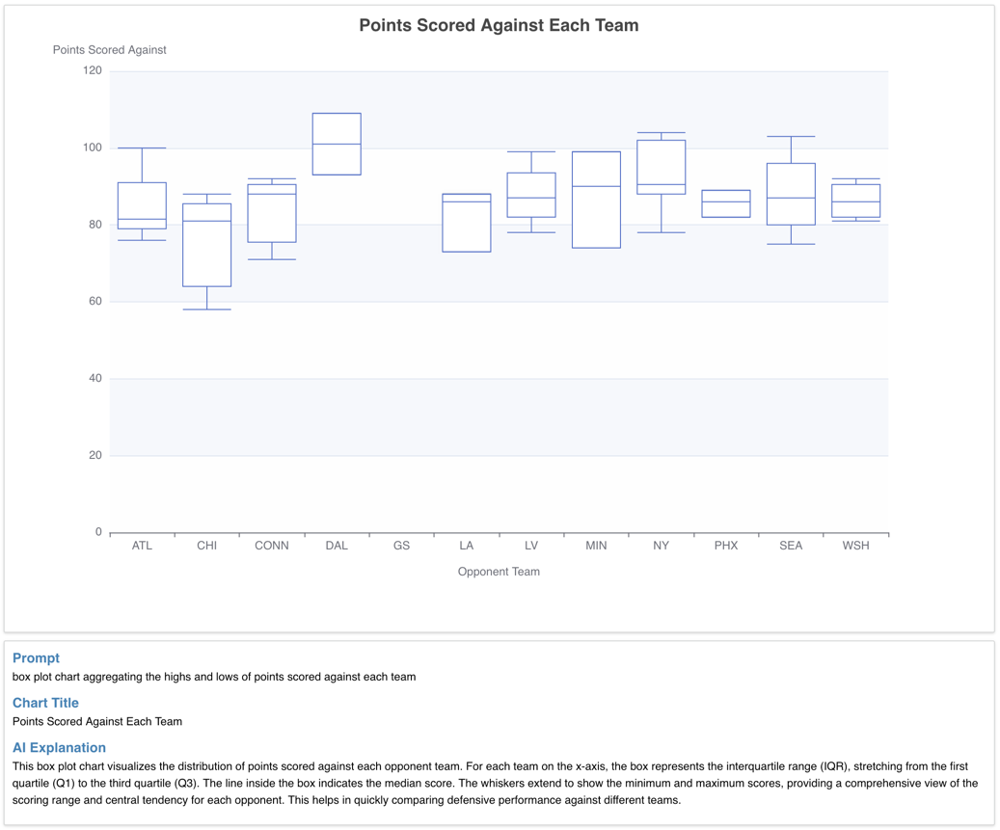
<p align="right">(<a href="#readme-top">back to top</a>)</p>

## Calendar Heatmap

**Prompt:** calendar heatmap showing points scored for each game in 2024
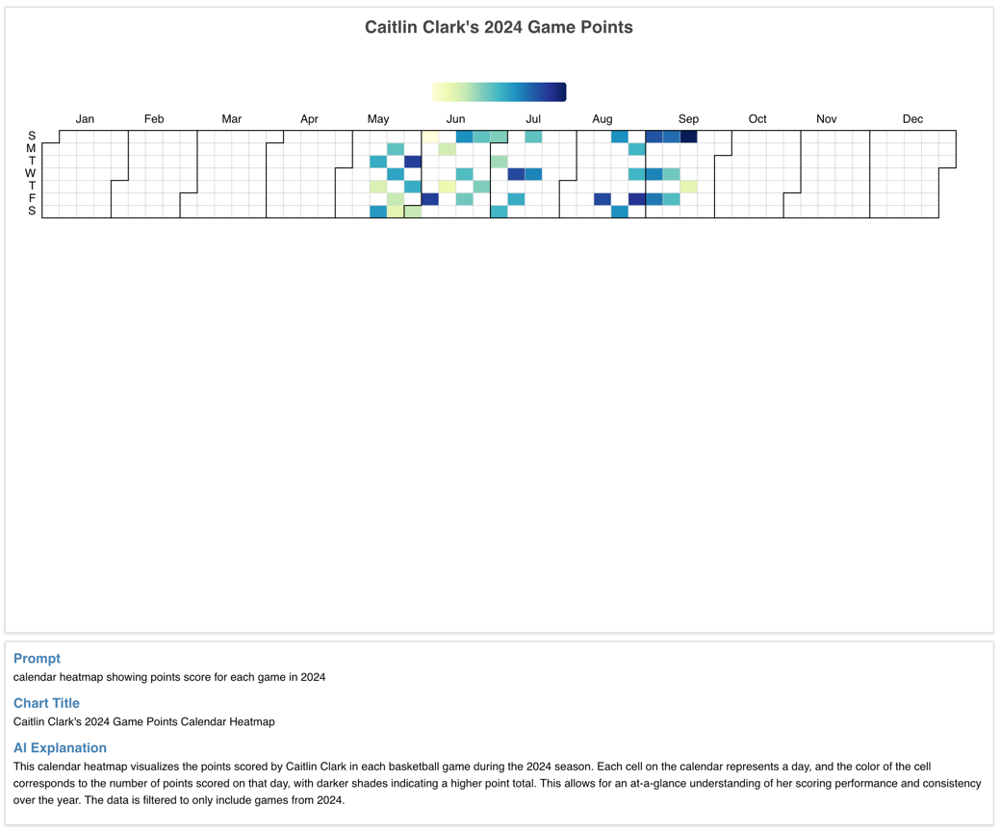
<p align="right">(<a href="#readme-top">back to top</a>)</p>

# Roadmap

- [x] Docker using Nginx as Reverse Proxy
- [x] API Rate Limiting
- [x] Session Middleware
- [ ] WebAuthn Middleware
- [ ] Combine multiple datasets from the UI
- [ ] Session History
- [ ] Deploy to [dfs.recipes](https://dfs.recipes)
- [ ] Mobile friendly CSS

<p align="right">(<a href="#readme-top">back to top</a>)</p>
